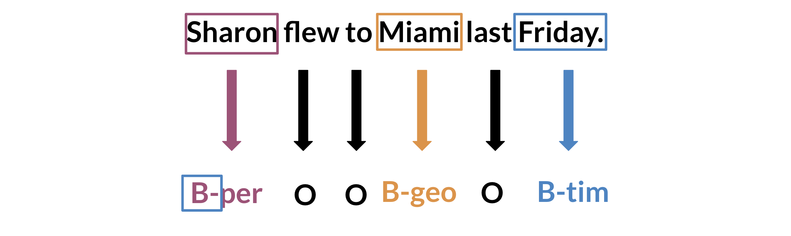

# NameNet -Entity-Spotter
 
## What I Learned and Built

This project was all about recognizing named entities in text, such as names of people, locations, organizations, and more. Named Entity Recognition (NER) is a core task in Natural Language Processing (NLP) that helps to extract structured information from unstructured text. My goal was to build an NER model capable of identifying and categorizing these entities within sentences. I worked with a labeled dataset and developed a deep learning model using TensorFlow and Keras to perform entity recognition.
 
One of the biggest challenges in this project was understanding the nature of sequential data. Sentences are composed of words that have an inherent order, and the meaning of each word is dependent on the words around it. This led me to explore different architectures for sequence modeling, and I ultimately worked with Recurrent Neural Networks (RNNs) and their more advanced versions like LSTMs and GRUs. These architectures are well-suited for capturing dependencies in sequential data, which is exactly what I needed for recognizing entities.

I also learned about text vectorization and embeddings, such as Word2Vec and GloVe, which are essential for converting words into numerical representations that can be fed into neural networks. One key aspect of NER is to maintain the context of words, as context defines whether a word like "Apple" refers to a fruit or the tech company. Word embeddings helped capture this semantic similarity and contextual meaning, making the model more accurate.

## How Useful It Is
 
NER is incredibly useful in a wide range of applications. From automating customer service responses to parsing through legal documents and extracting critical information, NER helps convert unstructured text into structured, usable data. In this project, I built a model that could recognize entities from news articles, which could be useful in building information extraction systems or even as a first step in building chatbots that understand user inputs better.

Through this project, I gained hands-on experience in sequence labeling and learned how powerful deep learning models can be when dealing with text. I also learned about the importance of balancing model complexity and training time—RNNs are powerful but can be computationally expensive, so I experimented with simpler models to see if they could achieve similar results with less computational cost.

## Key Insights
 
Sequential Data Handling: Text data isn't just a collection of words; it's sequential, and the order matters. Using RNNs and LSTMs taught me how to handle this type of data effectively. Understanding how past information influences current decisions in a sequence was a key takeaway.

Word Embeddings: I learned the importance of embedding layers to convert words into dense vectors that capture their meanings and relationships. This was crucial in improving the model's ability to generalize and recognize entities in different contexts.

Model Optimization: Training models for NER involves a lot of hyperparameter tuning. I experimented with different optimizers, learning rates, and batch sizes to find the best configuration for this task. This taught me the delicate balance between overfitting and underfitting in sequence models.

Practical Application: NER has practical uses in many industries. In finance, it can be used to extract key terms from reports; in healthcare, it can be used to recognize drug names or medical conditions in clinical notes. My model provides a foundation for such applications, and the insights I gained can be extended to more specialized domains.

## Conclusion

Overall, these two projects have deepened my understanding of NLP and sequence modeling, and given me practical experience with implementing deep learning models for real-world problems. Both the Siamese Network and NER are powerful tools in NLP, and building them taught me how to apply theoretical concepts in practice, overcome data challenges, and create models that can have meaningful applications.
